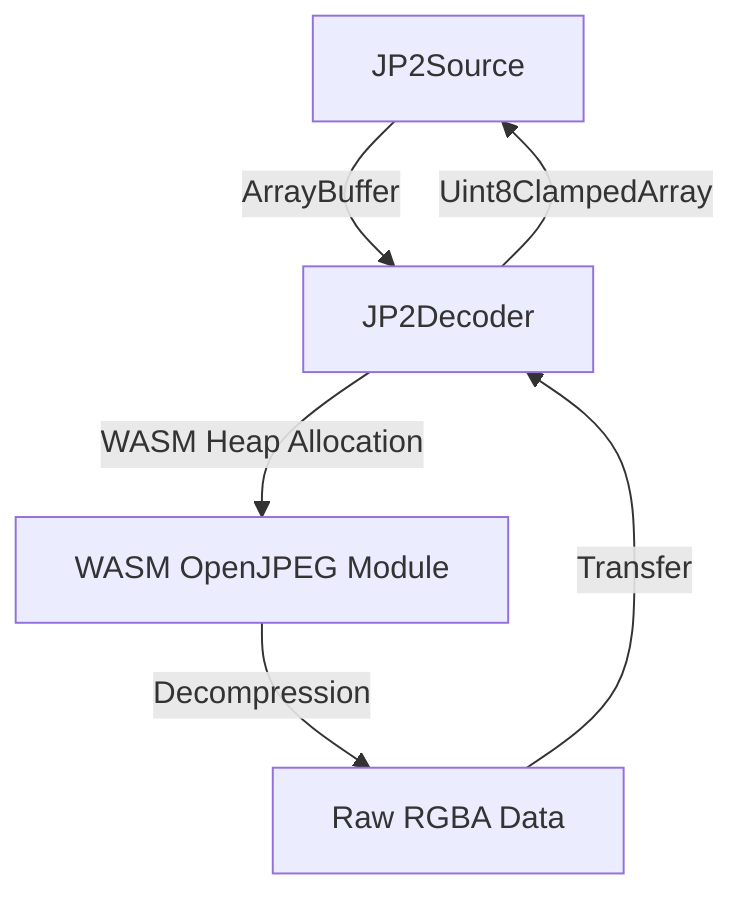

# Replace Mock Decoder with Real WASM Library Design Document

> Version: 1.0.0 | Created: 2026-02-26 | Status: Draft

## 1. Overview
This design focuses on integrating a real WebAssembly (WASM) JPEG2000 decoder into the `openlayers-jp2-provider`. We will target a robust library like `openjpeg-js` or a custom emscripten build of OpenJPEG. The goal is to replace the mock logic in `src/decoder.ts` with actual calls to a WASM module.

## 2. Architecture
### System Diagram


### Components
- **WASM Module Loader**: Handles fetching the `.wasm` file and initializing the Emscripten/WASM environment.
- **Buffer Manager**: Manages memory allocation on the WASM heap to ensure input bitstreams and output pixel data are correctly passed.
- **Decoding Wrapper**: Maps the OpenJPEG API to the `JP2Decoder.decode()` interface.

## 3. Data Model
### Entities
```typescript
interface WASMBuffer {
  ptr: number; // Pointer in WASM heap
  size: number;
}

interface DecoderInstance {
  _malloc: (size: number) => number;
  _free: (ptr: number) => void;
  HEAPU8: Uint8Array;
  decode: (dataPtr: number, dataSize: number) => number; // Returns pointer to decoded data
}
```

## 4. API Specification
### Classes and Methods
| Class | Method | Description |
|-------|--------|-------------|
| `JP2Decoder` | `init()` | Loads the WASM module and sets up the Emscripten runtime. |
| `JP2Decoder` | `decode(data)` | Allocates WASM memory, copies bitstream, calls WASM decode, and returns RGBA. |
| `JP2Decoder` | `cleanup()` | Frees allocated buffers on the WASM heap. |

## 5. UI Design
No UI changes are required; the improvement is purely at the data processing layer.

## 6. Test Plan
| Test Case | Expected Result |
|-----------|-----------------|
| Load Sample JP2 | Real image pixels are rendered correctly instead of a solid color. |
| Memory Leak Check | WASM heap usage remains stable after repeated decoding cycles. |
| Large File Decoding | Successful decoding of images larger than 1024x1024 without memory errors. |
| Error Handling | Graceful failure when passing invalid bitstreams to the WASM decoder. |
